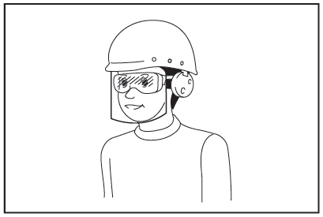

# Makita Cordless Hedge Trimmer - Model UH004G

An easy-to-use online guide for the Makita Cordless Hedge Trimmer.

---

### **Quick Links**
* [Accessories Provided](#1-accessories-provided)
* [Safety First](#2-safety-first)
* [Before You Operate](#3-before-you-operate)
* [Operation Guide](#4-operation-guide)
* [Troubleshooting](#5-troubleshooting)

---

### **1. Accessories Provided**
| Accessory | Details | Description |
| :--- | :--- |
| **Battery Cartridge** | BL4040f (x1) | 40V XGT 4ah lithium-ion battery |
| **Charger** | DC40RA | 40V XGT battery charger |

---

### **2. Safety First**

**WARNING: Read all safety warnings and instructions before use.** Failure to follow the warnings and instructions may result in electric shock, fire, and/or serious injury.

#### **Personal Safety**
 
 
* **DANGER - Keep hands away from blade.** Contact with the blade will result in serious personal injury.
* **Always wear eye and ear protection.**
* **Dress properly.** Do not wear loose clothing or jewellery. Keep your hair and clothing away from moving parts.
* **Wear protective footwear** and stout leather work gloves.

#### **Work Area Safety**
* **Inspect the area before use.** Check hedges and bushes for foreign objects like wire fences.
* **Keep children and bystanders away** while operating the trimmer.
* **Do not use the hedge trimmer in bad weather,** especially when there is a risk of lightning.

#### **Machine & Battery Safety**
* **Remove the battery** before checking, cleaning, or storing the machine.
* **Always fit the blade cover** when transporting or storing the hedge trimmer.
* **Hold the tool firmly with both hands** during operation.
* **The blades continue to move** for a few seconds after the switch is turned off.
* **Do not expose the tool to rain or wet conditions.**

---

### **3. Before You Operate**

**CAUTION: Always be sure that the tool is switched off and the battery cartridge is removed before carrying out any work on the tool.**

#### **Installing/Removing the Battery**

* **To Install:** Align the tongue on the battery cartridge with the groove in the housing and slide it in until it clicks. Make sure the red indicator is no longer visible.
* **To Remove:** Slide the battery cartridge out while pressing the button on the front of the cartridge.

#### **Adjusting the Handle Angle**

The rear handle can be set to 0°, 45°, or 90° to the left or right for comfortable operation.
1.  Pull down the lever on the handle.
2.  Turn the handle to the desired angle.
3.  Release the lever to lock the handle in place.

---

### **4. Operation Guide**

#### **Main Power and Speed Control**
* **Turn On:** Tap the main power button to turn the tool on.

* **Change Speed:** Each time you tap the main power button, the speed level will cycle from 1 (Low) to 2 (Medium) to 3 (High).
* **Turn Off:** Press and hold the main power button until the speed indicators go off.

#### **Starting the Trimmer**
This tool has a dual-switch system for safety.
1.  Depress the lock-off lever (2).
2.  Press the switch lever on the front handle (1).
3.  While holding both, pull the switch trigger (3).
4.  Release the switch trigger to stop.

#### **Reverse Button for Debris Removal**
If branches get jammed in the blades:
1.  Stop the tool.
2.  Tap the reverse button. The speed indicators will blink.
3.  Press the levers and pull the trigger to briefly move the blades in reverse to clear the jam.

#### **Operating Technique**
* **Hold the tool with both hands** and move it calmly and slowly.
* For a level hedge top, tie a string at the desired height and trim along it.

* To trim the side of a hedge, cut from the bottom to the top.
* **NOTICE:** Do not attempt to cut branches thicker than 10 mm in diameter with the tool!

---

### **5. Troubleshooting**

If you encounter an issue, check this table before seeking repairs.

| Problem | Probable Cause | Remedy |
| :--- | :--- | :--- |
| **Motor does not run.** | Battery is not installed or has no charge. | Install a fully charged battery cartridge. |
| **Motor stops after a short time.** | Battery charge is low or the machine is overheating. | Recharge the battery or allow the tool to cool down. |
| **Shear blades do not move.** | Foreign objects are caught between the blades. | **Stop immediately.** Use the reverse button. If that fails, remove the battery and clear the jam with pliers. |
| **Abnormal vibration.** | Shear blades are broken, bent, or worn. | **Stop immediately.** Remove the battery, then replace the shear blades. |
| **Blades and motor cannot stop.** | Electric malfunction. | **Remove the battery immediately** and ask your local authorized service center for repair. |

