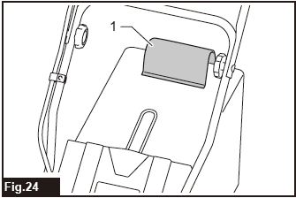

# Makita 18" Lawn Mower - Model DLM466

An easy-to-use online guide for the Makita 36V 18" Lawn Mower.
    * 

---

### Quick Links
* [Accessories Provided](#1-accessories-provided)
* [Safety First](#2-safety-first)
* [Before You Operate](#3-before-you-operate)
* [Operation Guide](#4-operation-guide)
* [Troubleshooting](#5-troubleshooting)

---

### 1. Accessories Provided

### 1. Accessories Provided

| Accessory | Details | Description |
| :--- | :--- | :--- |
| **Battery** | BL1850B (x4) | 18V LXT 5Ah lithium-ion batteries |
| **Charger** | DC18RD | 18V Dual battery charger - charges two batteries simultaneously |
| **Mulching Plug** | (Fig.15) | Used to block the exit channel for the grass clippings, allowing them to be cut into smaller pieces and deposited on the lawn as fertiliser.     |
---

### 2. Safety First

**WARNING: Read all safety warnings and instructions before use.** Failure to follow all instructions may result in electric shock, fire, and/or serious injury.

**Personal Safety**
* **Always wear eye protection.** Protective goggles must comply with ANSI Z87.1 (USA), EN 166 (Europe), or AS/NZS 1336 (Australia/New Zealand). In Australia/New Zealand, you are also legally required to wear a face shield.
* **Dress properly.** Do not wear loose clothing or jewellery. Keep your hair and clothing away from moving parts.
* **Wear protective footwear.** Always wear non-slip and protective footwear when operating the lawnmower.
* **Stay alert.** Do not use the mower while you are tired or under the influence of drugs, alcohol or medication.

**Work Area Safety**
* **Inspect the area before use.** Thoroughly inspect the area where the mower will be used and remove all stones, sticks, wires, bones, and other foreign objects.
* **Check for hidden objects.** Watch for holes, ruts, bumps, or rocks. Tall grass can hide obstacles.

**Machine & Battery Safety**
* **Disconnect the battery before maintenance.** Always ensure the mower is off and the battery is removed before cleaning, making adjustments, or storing the machine.
* **Keep hands and feet away from blades.** The mower blades continue to rotate for a few seconds after the motor is switched off.
* **Use only genuine Makita batteries and chargers.** Use of any other batteries may cause injury and/or fire.
* **Handle batteries carefully.** When not in use, keep the battery pack away from metal objects like paper clips, coins, or keys that could make a connection between terminals.

---

### 3. Before You Operate

**Install the Grass Basket**
1.  Open the rear cover of the mower.
2.  Hook the grass basket onto the rod of the mower body.
    * 

**Installing/Removing the Battery**
* **To Install:** Open the battery cover. Align the tongue on the battery with the slot in the mower and slide it in until it clicks and the red indicator is no longer visible.
    * 
* **To Remove:** Open the battery cover. Press the button on the front of the battery cartridge while pulling it out.
* **NOTE:** The tool requires two battery cartridges to operate.

**Checking Battery Capacity**
* **On the Machine:** An indicator lamp will blink red when the battery is low and light up solid red when it's empty.
    * 
* **On the Battery:** For batteries with an indicator, press the check button to see the charge level.
    * 

**Mode Switching Button**
* You can switch between **Normal Mode** and **Noise Reduction Mode** (energy-saving) by pressing the mode switching button. The green lamp indicates you are in Noise Reduction Mode.
    * 

**Adjusting the Mowing Height**
* The mowing height can be adjusted from **20 mm to 75 mm**.
* Pull the mowing height adjusting lever outward and move it to your desired height. Always ensure the lever fits properly in the groove before starting.
    * 

---

### 4. Operation Guide

**Starting the Machine**
1.  Install two charged battery cartridges.
2.  Press and hold the lock-off button.
3.  While holding the button, pull the switch lever towards you.
4.  Release the lock-off button once the motor starts.
    * 
5.  **To Stop:** Release the switch lever.

**Mowing Tips**
* Hold the handle firmly with both hands.
* The center lines of the front wheels are a guide for the mowing width. Overlap your previous path by one-half to one-third to ensure an even cut.
    * 
* For very long grass, mow in steps. Do not try to cut it all at once.
* **Emptying the Grass Basket:** The grass level indicator on the basket will float when it's not full (fig.24). When it stops floating, stop the mower and empty the basket (fig.25).
    * 
    * 

---

**WARNING: Always remove the battery cartridges and wear gloves before performing any inspection or maintenance.**

**Cleaning**
* After use, remove the batteries.
* Put the mower on its side and clean grass clippings from the underside of the deck.

---

### 5. Troubleshooting

If you encounter an issue, check this table before seeking repairs.

| Problem | Probable Cause | Remedy |
| :--- | :--- | :--- |
| **Mower does not start.** | Two battery cartridges are not installed.   Battery has no charge. | Install two fully charged battery cartridges.   Recharge or replace the battery. |
| **Motor stops after a short time.** | Battery charge is low.  Cutting height is too low.  Grass is clogging the mower. | Recharge the battery.  Increase the cutting height.  Turn off, remove battery, and clear the clog. |
| **Motor doesn't reach max speed.** | Battery power is dropping. | Recharge the battery cartridge. |
| **Blade does not rotate.** | A foreign object is stuck in the blades. | **Stop immediately.** Remove battery, then remove the object. |
| **Abnormal vibration.** | The blade is worn, damaged, or imbalanced. | **Stop immediately.** Remove battery, then replace the blade. |

---

