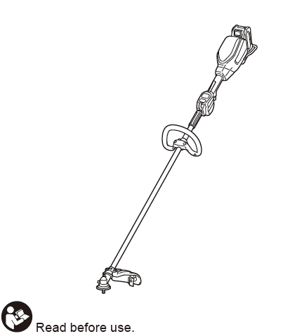

# Makita Cordless Grass Trimmer - Model UR008G

An easy-to-use online guide for your Makita Cordless Grass Trimmer.

---

### Quick Links
* [Specifications](#1-specifications)
* [Safety First](#2-safety-first)
* [Assembly Instructions](#3-assembly-instructions)
* [Before You Operate](#4-before-you-operate)
* [Operation Guide](#5-operation-guide)
* [Maintenance](#6-maintenance)
* [Troubleshooting](#7-troubleshooting)

---

### 1. Specifications

**Key Technical Details**
| Feature | Specification |
| :--- | :--- |
| **Model** | UR008G |
| **Handle Type** | Loop handle |
| **No Load Speed** | Speed 3: 0 - 6,000 min⁻¹   Speed 2: 0 - 4,600 min⁻¹   Speed 1: 0 - 4,000 min⁻¹ |
| **Overall Length** | 1,803 mm (without cutting tool) |
| **Nylon Cord Diameter** | 2.4 mm |
| **Rated Voltage** | D.C. 36 V - 40 V max |
| **Net Weight** | 5.0 - 6.3 kg |
| **Protection Degree** | IPX4 |

**Compatible Batteries & Chargers**
| Type | Model Numbers |
| :--- | :--- |
| **Battery Cartridge** | BL4020 / BL4025* / BL4040* / BL4050F* / BL4080F* (*Recommended) |
| **Charger** | DC40RA / DC40RB / DC40RC |

---

### 2. Safety First

**WARNING: Read all safety warnings and instructions before use.**

**Personal Safety**
* Always wear eye and ear protection, a helmet, and protective gloves.
* Do not wear loose clothing or jewellery. Keep hair away from moving parts.
* Always wear sturdy, non-slip shoes.

**Work Area Safety**
* Inspect the area before use and remove all stones, sticks, and other foreign objects.
* Maintain a distance of at least 15m from any bystanders or animals.

**Machine & Battery Safety**
* Disconnect the battery before any maintenance.
* Always hold the tool with both hands.
* Never use metal blades.
* Use the correct guard for the nylon cutting head.

---

### 3. Assembly Instructions

**WARNING: Always ensure the tool is off and the battery is removed before assembly.**

**Step 1: Install the Handle**
1.  Attach the clamps onto the damper on the tool's shaft.
2.  Place the handle on the upper clamp and secure it with the hex bolts.
    * 

**Step 2: Install the Protector (Guard)**
1.  Attach the protector to the clamp on the shaft using the bolts.
    * 

**Step 3: Install the Nylon Cutting Head**
1.  Turn the tool upside down.
2.  Insert the hex wrench to lock the spindle.
3.  Screw the nylon cutting head onto the spindle by hand.
4.  Remove the hex wrench.
    * 

---

### 4. Before You Operate

**Installing/Removing the Battery**
* **To Install:** Slide the battery cartridge in until it clicks.
* **To Remove:** Press the button on the battery while sliding it out.
    * 

**Main Power and Speed Control**
* **Turn On:** Tap the main power button.
* **Change Speed:** Tap the power button to cycle through speeds 1, 2, and 3.
* **Turn Off:** Press and hold the main power button.
    * 

---

### 5. Operation Guide

**Starting the Trimmer**
1.  Depress the lock-off lever.
2.  While holding the lock-off lever, pull the switch trigger.
3.  Release the switch trigger to stop.
    * 

**Feeding the Nylon Cord (Bump & Feed)**
* To feed out more line, gently tap the rotating cutting head against the ground.

---

### 6. Maintenance

**WARNING: Always ensure the tool is off and the battery is removed before maintenance.**

**Cleaning the Tool**
* Wipe the tool with a dry cloth to remove dust and debris.
* Keep the air vents clear to prevent overheating.

**Replacing the Nylon Cord**
* Only use a nylon cord with a 2.4 mm diameter.
* Refer to the diagrams in the original manual for your specific cutting head.
    * 

---

### 7. Troubleshooting

| Problem | Probable Cause | Remedy |
| :--- | :--- | :--- |
| **Motor does not run.** | Battery is not installed or has no charge. | Install a fully charged battery cartridge. |
| **Abnormal vibration.** | The cutting tool is broken, bent, or worn. | **Stop immediately.** Remove the battery, then replace the cutting tool. |
