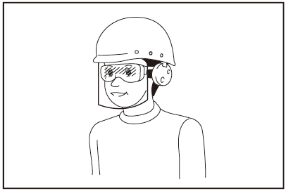
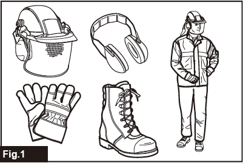
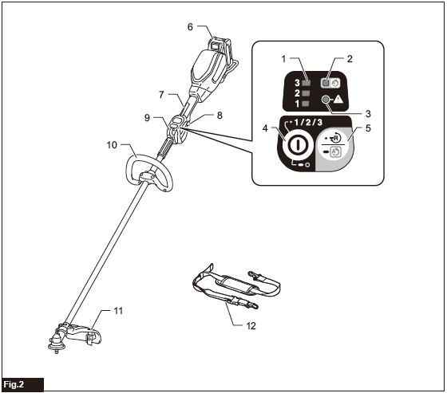
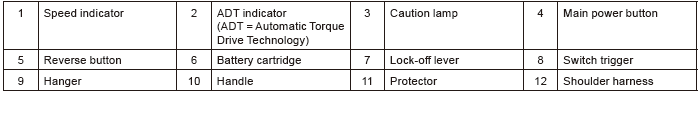
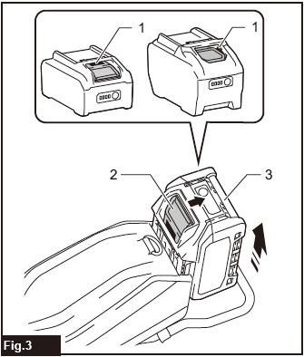
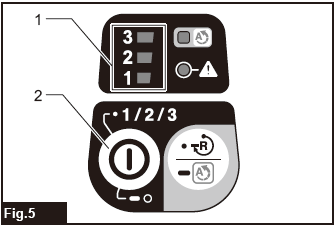
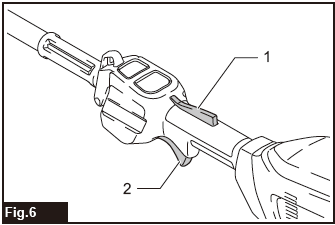
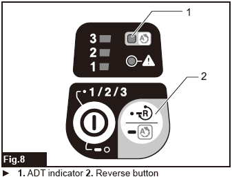
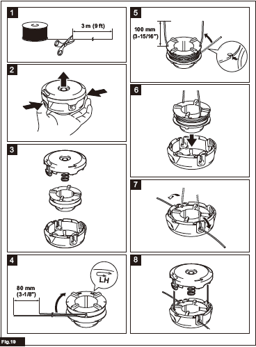

# Makita Cordless Grass Trimmer - Model UR008G

An easy-to-use online guide for your Makita Cordless Grass Trimmer.

---

### Quick Links
* [Safety First](#1-safety-first)
* [Before You Operate](#2-before-you-operate)
* [Operation Guide](#3-operation-guide)
* [Maintenance](#4-maintenance)
* [Troubleshooting](#5-troubleshooting)

---

**Included Accessories**
| Type | Model Numbers |
| :--- | :--- |
| **Battery Cartridge** | BL4040f (x2) |
| **Charger** | DC40RA |

---

### 1. Safety First

**WARNING: Read all safety warnings and instructions before use.**

**Personal Safety**
* Always wear eye and ear protection, a helmet, and protective gloves.

* Do not wear loose clothing or jewellery. Keep hair away from moving parts.
* Always wear sturdy, non-slip shoes.

**Work Area Safety**
* Inspect the area before use and remove all stones, sticks, and other foreign objects.
* Maintain a distance of at least 15m from any bystanders or animals.

**Machine & Battery Safety**
* Disconnect the battery before any maintenance.
* Always hold the tool with both hands.
* Never use metal blades.

---

### 2. Before You Operate

**Installing/Removing the Battery**
* **To Install:** Slide the battery cartridge in until it clicks.
* **To Remove:** Press the button on the battery while sliding it out.
    * 

**Main Power and Speed Control**
* **Turn On:** Tap the main power button.
* **Change Speed:** Tap the power button to cycle through speeds 1, 2, and 3.
* **Turn Off:** Press and hold the main power button.
    * 

---

### 3. Operation Guide

**Starting the Trimmer**
1.  Depress the lock-off lever.
2.  While holding the lock-off lever, pull the switch trigger.
3.  Release the switch trigger to stop.
    * 

**Feeding the Nylon Cord (Bump & Feed)**
* To feed out more line, gently tap the rotating cutting head against the ground.

**Automatic Torque Drive Technology**

When you turn on the Automatic Torque Drive Technology (ADT), the tool runs at optimum rotation speed and torque for the condition of grass being cut.
* **Turn On:** To start ADT, press and hold the reverse button until the ADT indicator turns on.
* **Turn Off** To stop ADT, press and hold the reverse button until the ADT indicator turns off.

---

### 4. Maintenance

**WARNING: Always ensure the tool is off and the battery is removed before maintenance.**

**Cleaning the Tool**
* Wipe the tool with a dry cloth to remove dust and debris.
* Keep the air vents clear to prevent overheating.

**Replacing the Nylon Cord**
* Only use a nylon cord with a 2.4 mm diameter.
* Refer to the diagrams in the original manual for your specific cutting head.
    * 

---

### 5. Troubleshooting

| Problem | Probable Cause | Remedy |
| :--- | :--- | :--- |
| **Motor does not run.** | Battery is not installed or has no charge. | Install a fully charged battery cartridge. |
| **Abnormal vibration.** | The cutting tool is broken, bent, or worn. | **Stop immediately.** Remove the battery, then replace the cutting tool. |
