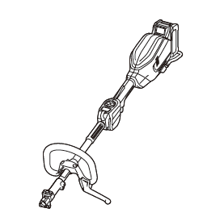
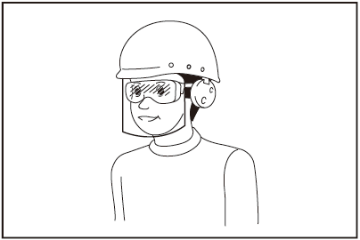
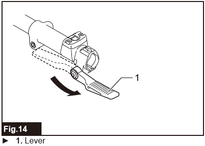
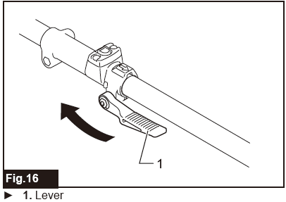
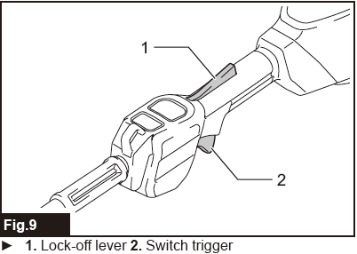
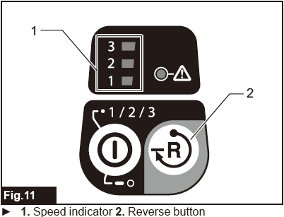
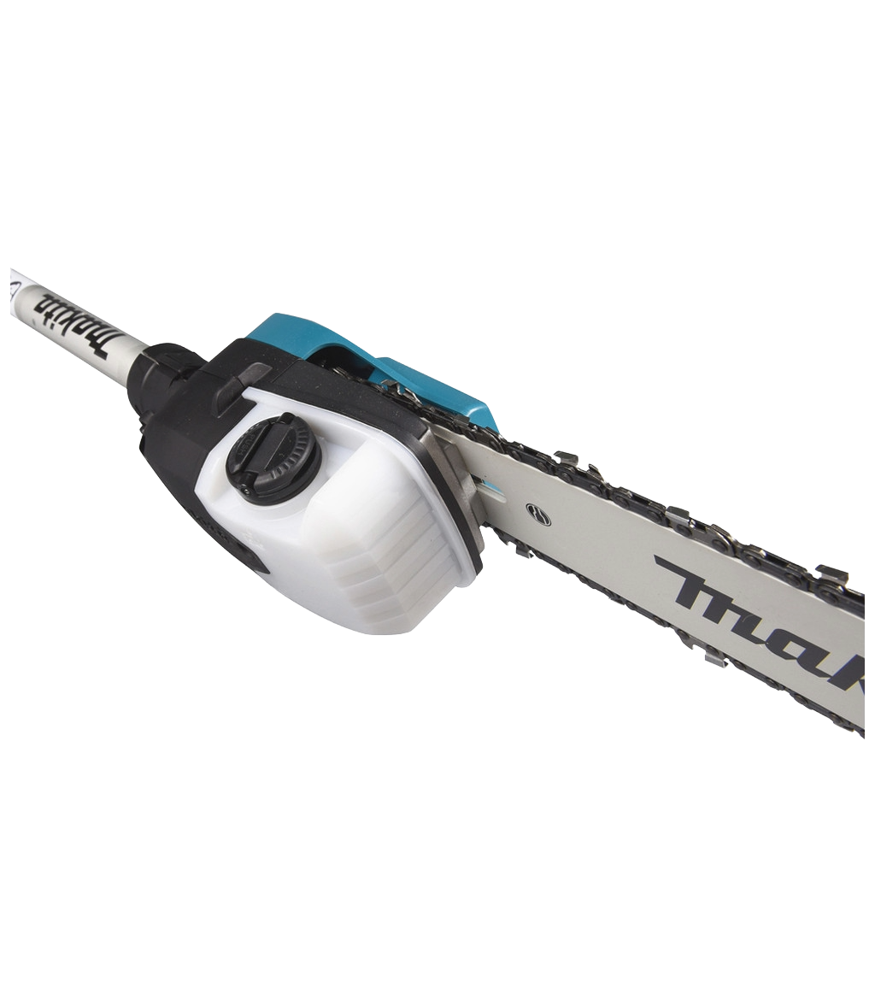

# Makita Cordless Multi Function Power Head - Model UX01G

An easy-to-use online guide for the Makita Cordless Multi Function Power Head and attachments.

---

### Quick Links
* [Safety First](#1-safety-first)
* [Before You Operate](#2-before-you-operate)
* [Attachment: EY403MP Pole Saw](#3-pole-saw-attachment-ey403mp)
* [Attachment: EN402MP Hedge Trimmer](#4-hedge-trimmer-attachment-en402mp)
* [Maintenance](#5-maintenance)
* [Troubleshooting](#6-troubleshooting)

---

**Included Accessories**
| Type | Model Numbers |
| :--- | :--- |
| **Battery Cartridge** | BL4040 (x2) |
| **Charger** | DC40RA |

---

### 1. Safety First

**WARNING: Read all safety warnings and instructions before use.**

**Personal Safety**
* Always wear a helmet, eye protection, ear protection, and protective gloves.
* **Pole Saw Use:** Always wear a hard hat to protect from falling branches.
* **Hedge Trimmer Use:** Keep both hands on the handles; never reach near the blades.

**Work Area Safety**
* **Overhead Lines:** Danger! Keep the pole saw at least 15m away from electric power lines.
* Maintain a distance of at least 15m from any bystanders or animals.

---

### 2. Before You Operate

**Connecting Attachments**
1. Loosen the knob on the power head joint.
2. Align the pin with the arrow mark on the attachment.
3. Insert the attachment until the release button pops up.
4. Tighten the knob securely.
    * 
    * 

**Main Power and Speed Control**
* **Turn On:** Tap the main power button.
* **Change Speed:** Tap the power button to cycle through speeds 1, 2, and 3.
    * *Tip: Use Speed 1 for light trimming to save battery.*
    * 

---

### 3. Operation Guide

**Starting the Tool**
1. Depress the lock-off lever.
2. While holding the lock-off lever, pull the switch trigger.
3. Release the switch trigger to stop.
    * 

**Reverse Button (Debris Removal)**
* If debris gets tangled in the head:
1. Tap the **Reverse Button**
2. Pull the trigger. The tool will spin backward for a few seconds to clear the debris.
3. Tap the Reverse Button again to return to normal rotation.
    * 

**Active Feedback Sensing Technology (AFT)**
* If the tool detects a sudden drop in speed (like hitting a solid object), the **Green Caution Lamp** will blink and the tool will stop to prevent kickback.
* Release the trigger and check the head before restarting.

### 4. Pole Saw Attachment (EY403MP)

**Before Use: Check Chain Oil**
* Check the oil tank level through the viewing window.
* **NEVER run the saw without Bar & Chain oil.** Use provided Bar & Chain Oil.
* Check oil levels regularly and top-up as necessary to prevent running dry.
    * 

**Adjusting Chain Tension**
1. Loosen the nut on the sprocket cover.
2. Turn the adjustment screw clockwise to tighten the chain.
3. The chain is correctly tensioned when it does not sag but can still be turned by hand.
    * 

**Cutting Technique**
* Stand at an angle of 60° or less to the ground.
* Cut large branches in sections from the tip to the base.

---

### 5. Hedge Trimmer Attachment (EN402MP)

**Adjusting the Cutting Angle**
1. Pull the **Red** lever and hold it.
2. Tilt the head to your desired angle using handle (135° range).
3. Release the lever to lock it into place.
    * 

**Operation**
* Use the front grip for maximum control.
* Swing the trimmer in an arc along the face of the hedge.
* **WARNING:** Do not attempt to cut branches thicker than 20mm.

---

### 5. Maintenance

**WARNING: Always remove the battery before maintenance.**

* **Cleaning:** Wipe the motor head and attachments with a dry cloth.
* **Saw Care:** Clean the bar groove and oil hole after every use.
* **Trimmer Care:** Apply light machine oil to the blades before and after use to prevent rust.
    * 

---

### 6. Troubleshooting

| Problem | Probable Cause | Remedy |
| :--- | :--- | :--- |
| **Motor does not run.** | Battery empty or not installed. | Install a fully charged battery. |
| **Pole Saw not cutting.** | Chain is dull or installed backward. | Sharpen chain or check rotation direction. |
| **Saw Chain is dry.** | Oil tank empty or oil hole blocked. | Fill oil tank and clean the oil guide groove. |
| **Trimmer blades jammed.** | Branch is too thick or debris in teeth. | **Remove battery.** Clear debris with a tool (not hands). |
| **Green Light Blinking.** | AFT triggered (Sudden jam). | Release trigger, clear the jam, and restart. |
