# Makita Cordless Scarifier - Model UV001G

An easy-to-use online guide for the Makita Cordless Scarifier.
* 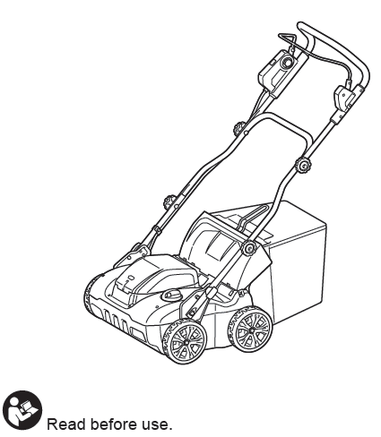
---

### Quick Links
* [Accessories Provided](#1-accessories-provided)
* [Safety First](#2-safety-first)
* [Before You Operate](#3-before-you-operate)
* [Operation Guide](#4-operation-guide)
* [Troubleshooting](#5-troubleshooting)

---

### 1. Accessories Provided

| **Battery** | **Charger** | **Scarifier Blade** | **Dethatching Blade** | 
| :--- | :--- | :--- |
| **Battery Cartridge** | BL4080F (X2) |
| **Charger** | DC40RB |
| **Scarifier blade** (Fig.6) | Cuts into the soil to remove thatch and allow water and nutrients deep into the soil - Use in April/May September/October | 
| **Dethatching blade** (Fig.7) | Lifts layers of thatch and moss - Ideal year-round use | 

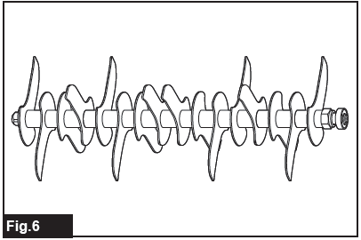

---

### 2. Safety First

**WARNING: Read all safety warnings and instructions before use.** Failure to follow all instructions may result in electric shock, fire, and/or serious injury.

**Personal Safety**
 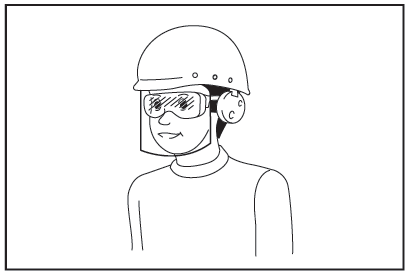

* **Always wear eye protection.** Protective goggles must comply with ANSI Z87.1 (USA), EN 166 (Europe), or AS/NZS 1336 (Australia/New Zealand). In Australia/New Zealand, you are legally required to wear a face shield.
* **Dress properly.** Do not wear loose clothing, jewellery, or cloth work gloves which may get entangled. Keep hair and clothing away from moving parts.
* **Wear protective footwear.** Always wear substantial, non-slip footwear. Do not operate the machine barefoot or in open sandals.
* **Stay alert.** Do not use the tool while tired or under the influence of drugs, alcohol, or medication.

**Work Area Safety**
* **Inspect the area before use.** Remove all stones, sticks, wires, bones, and other foreign objects from the work area. Thrown objects can cause severe injury.
* **Check for hidden objects.** Watch for holes, ruts, bumps, or other hidden objects. Tall grass can hide obstacles.
* **Keep bystanders away.** Keep children, pets, and bystanders at least 15m away from the machine during operation.

**Machine & Battery Safety**
* **Disconnect the battery before maintenance.** Always ensure the machine is off and the battery is removed before cleaning, making adjustments, or storing the machine.
* **Keep hands and feet away from blades.** The scarifier blades continue to rotate for a few seconds after the machine is switched off.
* **Use only genuine Makita batteries and chargers.** Use of any other batteries may cause injury and/or fire.
* **Do not expose the battery to fire or high temperatures.** Temperatures above 130°C may cause an explosion.
* **Handle batteries carefully.** When not in use, keep the battery pack away from metal objects like paper clips, coins, or keys that could make a connection between terminals.

---

**Installing the Grass Basket**
1.  Lift open the rear cover.
    * 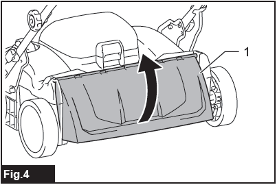
2.  Hold the handle of the grass basket.
3.  Insert the rod of the grass basket into the grooves on the machine body.
    * 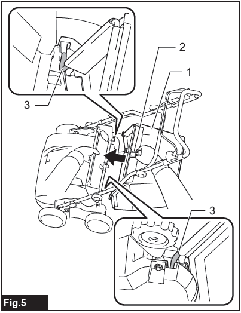

---

### 3. Before you operate

**Installing/Removing the Battery**
1.  **To Install:** Pull up the locking lever and open the battery cover. Align the tongue on the battery with the slot in the machine and slide it in until it clicks. Close the cover securely.
    * 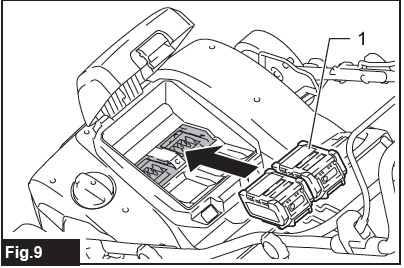
2.  **To Remove:** Open the battery cover. Press the button on the front of the battery cartridge while pulling it out.

---

**Checking Battery Capacity**
* **On the Machine:** A battery indicator light shows the remaining capacity. When it blinks, the battery is low. When it lights up solid, the machine will stop.
    * 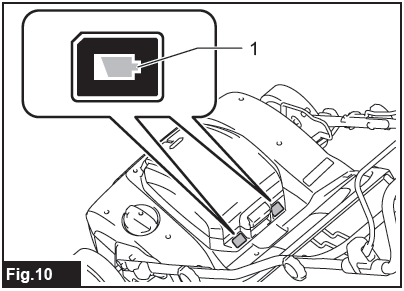
* **On the Battery:** Press the check button on the battery cartridge itself to see the charge level on the indicator lamps.
    * 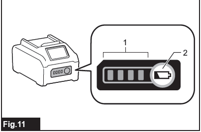

---

**Main Power Switch**
* To turn the machine on, press the main power switch. The lamp will light up green.
    * 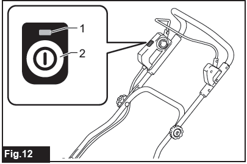
* To turn the machine off, press the main power switch again.
* **Auto Power-Off:** The machine will automatically shut down if the switch lever is not pulled for a certain period.

---

**Adjusting the Working Depth**
The working depth can be adjusted between +5 mm and -12 mm.
1.  Turn off the machine.
2.  Press the lock-off button and turn the adjusting dial.
    * 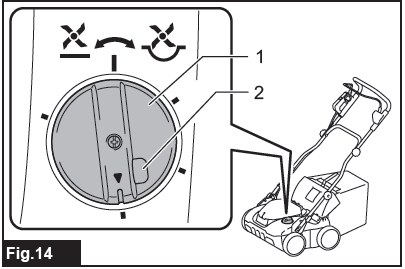
    * Turning left makes the depth shallower (up to +5 mm).
    * Turning right makes the depth deeper (down to -12 mm).
    * The upper center position is 0 mm.
    * 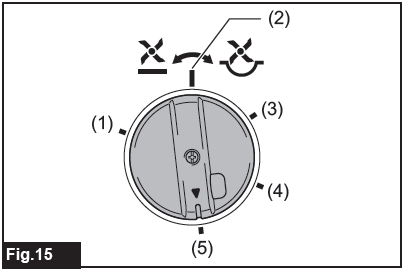
* **NOTICE:** When using thatching blades, do not set the depth deeper than -4 mm.

---

### 4. Operation Guide

**Starting the Machine**
1.  Ensure the work area is clear of stones, sticks, and other debris.
    * 
2.  Press the main power switch. The power lamp will turn green.
    * 
3.  Press and hold the switch button.
4.  While holding the button, pull the switch lever towards you.
5.  Release the switch button once the motor starts.
    * 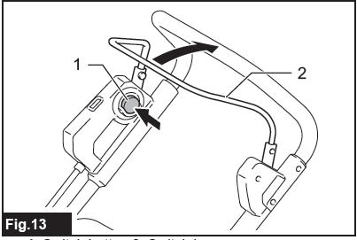
6.  **To Stop:** Release the switch lever. The electric brake will quickly stop the blades.

---

**Operating the Scarifier**
* Hold the handle firmly with both hands.
    * 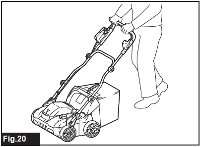
* Walk, never run.
* A good operating speed is about 5 to 8 meters per 10 seconds.
* Use the marks on the front of the machine as a guide for the working width.
    * 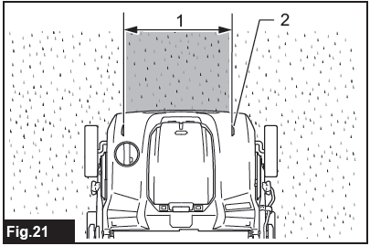
* On slopes, always work across the face of the slope, never up and down.

---

**Emptying the Grass Basket**
1.  Stop the machine by releasing the switch lever. Turn off the main power switch.
2.  Open the rear cover.
   * 
3.  Lift out the grass basket by its handle and empty it.
4.  Re-install the basket and close the rear cover.
* **NOTICE:** A full grass basket puts extra load on the motor. Empty it regularly before it becomes full.

---

**Replacing the Scarifier Blades**
1.  Remove the battery and place the machine on its side.
2.  Loosen and remove the two bolts and the bracket holding the blade assembly.
    * 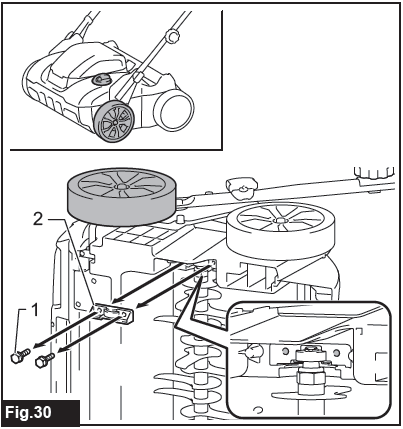
3.  Lift the blade assembly out of the machine. You can use a screwdriver to gently pry it up if needed.
    * 
4.  To install the new blades, insert one end into the hole and the other end into the groove.
    * 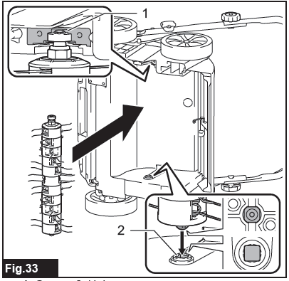
5.  Re-attach the bracket and securely tighten the bolts.
    * 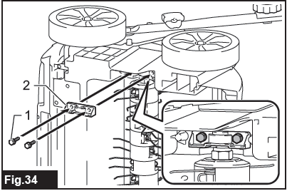

---

### 5. Troubleshooting

If you encounter an issue, check this table.

| Problem | Probable Cause | Remedy |
| :--- | :--- | :--- |
| **Machine does not start.** | Battery not installed, or has no charge. | Install a fully charged battery cartridge. |
| **Motor stops after a short time.** | Battery charge is low. Working depth is too deep. Grass is clogging the machine. | Recharge the battery. Set the working depth shallower. Turn off, remove battery, and clear the clog. |
| **Motor doesn't reach max speed.** | Battery power is dropping. | Recharge the battery cartridge. |
| **Blades do not rotate.** | A foreign object is stuck in the blades. | **Stop immediately.** Remove battery, then remove the object. |
| **Abnormal vibration.** | Blades are worn, damaged, or imbalanced. | **Stop immediately.** Remove battery, then replace the scarifier blades. |

---

